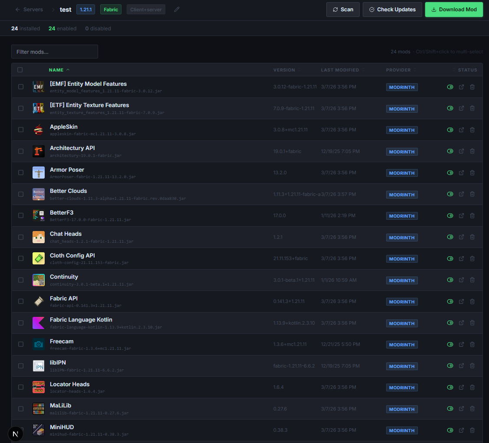
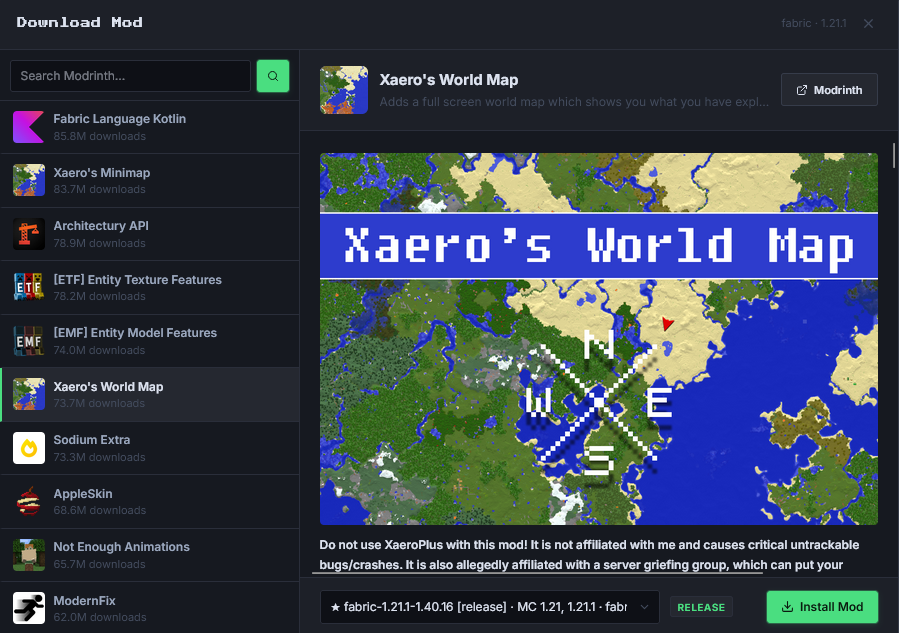

# MC Mods Manager
> Browse, update & organise mods for your Minecraft servers

## What is it
MC Mods Manager is a self-hosted web UI for managing mods across one or more Minecraft servers.
It scans your server's mods folder, identifies each mod via the Modrinth API, and lets you enable,
disable, update, or swap mods — all from a clean browser interface. No manual file hunting required.

## Why use it
Managing mods across multiple Minecraft servers means juggling `.jar` files, checking Modrinth
manually, and guessing which version is compatible. MC Mods Manager centralises everything: scan a
folder, see every mod at a glance, check for updates with one click, and download new mods directly
from Modrinth — without ever leaving the browser.

## Screenshots





## Installation

**Prerequisites:** [Docker](https://docs.docker.com/get-docker/) & [Docker Compose](https://docs.docker.com/compose/)

```bash
git clone https://github.com/gus-automates/mc-mods-manager.git
cd mc-mods-manager
```

Edit `docker-compose.yml` and mount your Minecraft server directories:

```yaml
volumes:
  - ./data:/app/data
  - /path/to/your/minecraft/server:/mc/server1   # add one per server
```

Then start the app:

```bash
docker compose up -d --build
```

Open **http://localhost:3000** in your browser.

## Usage

1. Click **Add Server** and enter a name and the path to your mods folder (e.g. `/mc/server1/mods`). MC version and loader are detected automatically.
2. Click **Scan** to detect all installed mods and match them against Modrinth.
3. Click **Check Updates** to see which mods have newer versions available.
4. Use **Download Mod** to search Modrinth and install a mod directly to the server folder.

## Features

**Done**
- ✅ Manage multiple Minecraft servers from a single dashboard
- ✅ Auto-scan mods folder and identify mods via Modrinth (SHA-512 hash matching)
- ✅ Auto-detect Minecraft version and mod loader from the server directory
- ✅ One-click update check against Modrinth for all installed mods
- ✅ Download & install mods directly from Modrinth search
- ✅ Enable / disable mods without deleting them (`.jar` ↔ `.jar.disabled`)
- ✅ Bulk select, delete, and toggle mods
- ✅ Missing dependency detection with one-click install
- ✅ Supports Fabric, Forge, NeoForge, and Quilt
- ✅ Docker-ready with persistent data volume
- ✅ One-click update all outdated mods at once

**Planned**
- ⬜ CurseForge mod support

## Contributing
Issues and PRs are welcome. Please open an issue before submitting large changes.

## License
[MIT](https://opensource.org/licenses/MIT)
